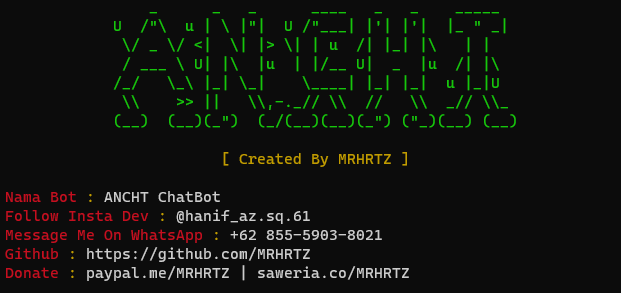

<!-- <h1>ANCHT BOT</h1> -->

## Installation
- Install node js ( <a href="https://nodejs.org/en/download/">Download Here</a> )
- clone this repo ( git clone https://github.com/Alvian03/Anon-Chat )
- Goto this directory ( cd Anon-Chat )
- Install It ( npm i )
- Run ( npm start )

## Features
- Connect with people support text message, sticker and other media!
- Added broadcast feature text & image with caption
- Light library without any heavy database ( json only )
- All platform supported, also termux.

## Note
- You can change sessions and owner at src/settings.json
- For different session you must change session name at settings 

## Contact Me
- <a href="https://wa.me/62895414533737?text=Hi">WhatsApp</a>
- <a href="https://www.instagram.com/vianjg.03_">Instagram</a>

## Deploy Heroku

